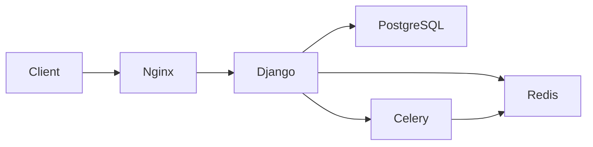

# Yours Scently
AI, 설문 기반 향수 추천 및 커머스 플랫폼

---

## 프로젝트 소개
**Yours Scently**는 사용자의 감성 키워드와 취향 설문을 기반으로 향수를 추천하고,  
상품을 구매할 수 있는 통합 서비스입니다.

### 주요 기능:
- AI 기반 감성 분석 및 향수 추천
- 설문 기반 취향 분석 및 추천
- 상품 조회, 찜하기
- 사용자 향기 취향, 마이페이지 기능
- 회원 관리 (회원가입, 로그인, 소셜 로그인, 회원 탈퇴)

---

## 기술 스택 (Tech Stack)

| Category       | Tech |
|----------------|------|
| Backend        | Django, DRF, Celery |
| Database       | PostgreSQL + pgvector |
| Cache/Broker   | Redis |
| Infra          | Docker, Docker Compose, Nginx, Gunicorn |
| AI / NLP       | Clova Studio, sentence-transformers |
| Data Analysis  | pandas, numpy, scikit-learn |
| Storage        | NCP Object Storage, boto3 |

---

## 아키텍처 (Architecture)



---

## 설치 및 실행 (Installation & Usage)
1. 요구 사항

Docker, Docker Compose 설치 필요

2. 실행 방법
### 프로젝트 클론

```
git clone https://github.com/oz-main-10-team1/yours-scently-be.git
cd yours-scently-be
```

### 컨테이너 빌드 및 실행
`docker-compose up -d --build`

3. 접속

swagger: http://localhost:8000/api/schema/swagger-ui/#/

---

## 팀 동료

### BE

| <a href=https://github.com/kyukyu300><br/><sub><b>@kyukyu300</b></sub></a><br/> | <a href=https://github.com/somineda/><br/><sub><b>@somineda</b></sub></a><br/> | <a href=https://github.com/yeontae519><br/><sub><b>@yeontae519</b></sub></a><br/> | <a href=https://github.com/hoonii111><br/><sub><b>@hoonii111</b></sub></a><br/> | <a href=https://github.com/jee1021><br/><sub><b>@jee1021</b></sub></a><br/> |
|:----------:|:----------------------------------:|:--------------------------------------------------------------------------------------------------------------------------------------------------------------------:|:-----------------------------------------------------------------------------------------------------------------------------------------------------------:|:----------:|
| 김규진 | 윤소민 | 김태연 | 정명훈 | 임지원 |


---

## 📑 프로젝트 규칙

### Code Convention
> - 패키지명 전체 소문자
> - 클래스명, 인터페이스명 PascalCase
> - 클래스 이름 명사 사용
> - 상수명 UPPER_SNAKE_CASE

### Communication Rules
> - Discord 활용 
> - 데일리 스크럼